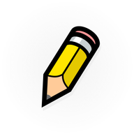

# Ready Draw

<p align="center">
  
</p>

A web-based drawing application that lets you create quick sketches and creative doodles in your browser.

## ✨ Features

- **Drawing Tools**: Pencil and brush tools with adjustable stroke widths
- **Color Selection**: Rich color palette with a wide range of options
- **Fill Tool**: Easily color areas with the bucket fill tool
- **History Management**: Undo functionality to correct mistakes
- **Export Options**: Save your drawings as PNG files
- **Responsive Design**: Clean, touch-friendly interface that works on desktop and mobile devices

## 🚀 Getting Started

### Prerequisites

- Node.js (v14 or newer)
- Yarn or npm package manager

### Installation

1. Clone this repository
   ```
   git clone https://github.com/beezus/readydraw-app.git
   cd readydraw-app
   ```

2. Install dependencies
   ```
   yarn install
   ```

3. Start the development server
   ```
   yarn start
   ```

4. Launch your browser and navigate to [`http://localhost:3000`](http://localhost:3000).

## 🎨 Usage

- **Select a Tool**: Choose a drawing tool from the toolbar
- **Pick a Color**: Select a color from the palette
- **Adjust Settings**: Change brush size as needed
- **Create**: Draw on the canvas
- **Edit**: Use the undo button to revert changes
- **Reset**: Clear the canvas to start over
- **Save**: Export your creation as a PNG file when finished
